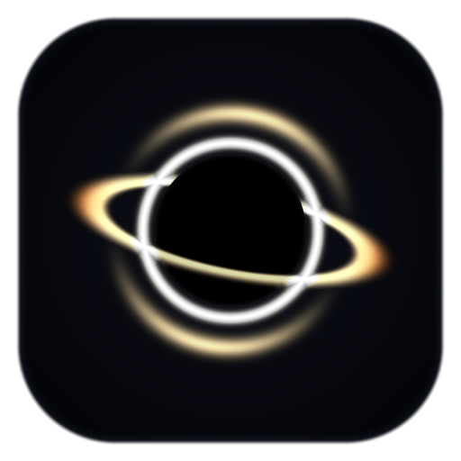
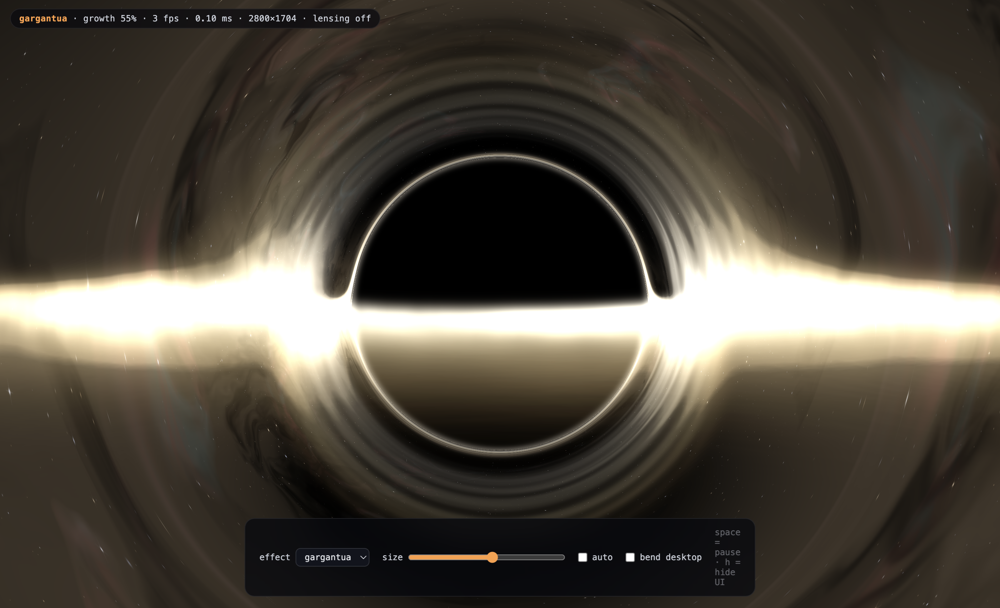

<div align="center">



# BlackHolock

### *Nothing escapes the break.*

**A focus timer with a gravitational deadline.**
Work, and a black hole is born on your screen. It grows every second, bending
your desktop around it with real gravitational lensing, until it swallows the
screen and takes your break for you.

[](LICENSE)
[](#install)
[](docs/legal/PRIVACY.md)
[](#languages)

**English** · [Español](#español) · [Türkçe](#türkçe)

</div>

---

## Why this exists

Every break reminder can be dismissed with one click, so every break reminder
gets dismissed. BlackHolock removes the click.

Instead of a notification you can ignore, an object appears on your screen and
grows. At first it is a few pixels wide and easy to work around. Five minutes
later it has eaten everything. You do not decide to take the break — the break
arrives, the way gravity arrives.

The pressure is visual and continuous rather than a sudden interruption, which
means you get several minutes of warning to reach a natural stopping point in
what you are doing.

## What makes the black hole real

The effect is not a picture, a video, or a swirl filter. It is a physically
ray-traced Schwarzschild black hole computed on your GPU, every frame.

For every pixel on screen, the shader integrates the path a photon actually
takes through curved spacetime:

```
d²u/dφ² + u = (3/2)·rs·u²         u = 1/r
```

Everything you see falls out of that integration rather than being drawn on
top of it:

| What you see | Where it comes from |
| --- | --- |
| **The shadow** | Rays with impact parameter below 3√3/2·rs are captured and never return. The result is true `#000000` — an actually unlit pixel on OLED. |
| **The disc over the top** | The accretion disc is flat and edge-on, but light bends far enough that you see its *far side* above and below the hole. This is the Interstellar silhouette, and it emerges from the maths. |
| **The photon ring** | Light that orbits the hole before escaping, piling up at the critical radius. |
| **The filaments shearing** | The disc is a slab with real thickness that rays integrate *through*, not a thin plane coloured at one point. Structure rotates differentially, so inner material laps outer material. |
| **Your bent desktop** | Your real screen is captured into GPU memory and sampled along the *deflected* ray, so your windows and text curve around the hole exactly as starlight would. |
| **The glow around it** | A two-scale bloom pass, so light spills past its own edges the way it does through a real lens. Without it a bright disc is merely pale; with it, it is luminous. |

### Why the disc is symmetric

A complete render applies relativistic Doppler beaming and gravitational
frequency shift to the orbiting material. Both are real. Both were deliberately
switched off for the film — Kip Thorne's account of the decision is that with
them on, *"the right side of the disk becomes so dark you can hardly see it, and
the left side becomes so bright that it dominates in a really puzzling way."*
Double Negative could render it correctly; Nolan chose clarity.

BlackHolock exposes that decision as a number rather than hiding it.
`DOPPLER_MIX` ships at 0.12: enough asymmetry to read as a rotating object, far
short of drowning one side. Set it to 1.0 for the physically complete image.

<div align="center">

<br><em>The shipped shader, mid-countdown. Ray-traced geodesics, volumetric disc, two-scale bloom.</em>
</div>

## How a cycle works

```
0 ─────────────────────────── 45 ──────── 50 ─────────────── 60 min
│         focus                │ countdown │      break        │
│      nothing on screen       │ hole grows│  screen is taken  │
│      zero GPU cost           │ and wanders│  countdown shown │
```

Every number is yours to change: focus length, break length, and how early the
hole appears. The defaults are 50 / 10 with a 5-minute countdown; presets for
25/5 and 90/15 are one click away.

The hole holds **completely still** for the first 30 % of the countdown, then
grows exponentially rather than linearly. On a five-minute window that is seven
pixels across and motionless for the first ninety seconds, sixteen pixels at
three minutes, and the whole screen in the last sixty seconds — a distant object
you noticed, not an animation playing at you.

Nine colours, disc brightness and rotation, viewing angle, Doppler amount, star
density, nebula brightness, glow and suction are all sliders, and the preview
above them updates as you drag.

## Features

- **Physically ray-traced lensing** at your display's true refresh rate, 120 Hz
  ProMotion included.
- **Ten effects, and a plug-in architecture for more.** Four black holes —
  Gargantua (the film's grade), Inferno (a simulation still in red and amber),
  Halo (a dark sphere ringed with light in a cool nebula field) and Prism
  (dispersion split into rainbow bands) — four weather events — Rain, Snow, Flood
  and Quake, each of which takes the screen a different way and costs a quarter
  of what a ray-marched hole does — plus Eclipse for something calm and Void
  Field for machines with no GPU budget. The four holes are variations of
  one shader selected by a uniform, so they share a compiled program and cost
  the same to draw.
- **The desktop is pulled in, not just bent.** Sampling of your captured screen
  winds around the hole and draws inward, falling off as 1/r¹·⁴ and scaling with
  the countdown, so your windows visibly spiral toward it as the break nears.
- **Live preview in the settings.** The Appearance panel runs the same renderer
  the overlay uses, so what you tune is exactly what you will see.
- **Multi-display.** Every screen is covered, so you cannot simply look at the
  other monitor.
- **The break opens onto deep space.** Nebulae, a dense star bed and slow
  meteors, with a countdown in the middle — deliberately dim, because the point
  of those ten minutes is to rest your eyes.
- **Three strictness levels.** From "dismiss it instantly" to "no way out".
  In the middle, the skip button appears late and asks twice — a stray click can
  never cost you a break. Escape summons it immediately for anyone who genuinely
  needs out.
- **11 languages**, switchable instantly with no restart, including full
  right-to-left layout for Arabic.
- **Accessibility built in.** Reduce-motion, an intensity dial, and a
  motion-free effect for anyone sensitive to moving visuals.
- **Zero network, zero accounts, zero telemetry.** The only request the app can
  ever make is an optional version check you can switch off.

## Install

Download the latest build for your platform from
[**Releases**](https://github.com/GhostFelina/BlackHolePomodoro/releases).

**macOS** — open the `.dmg`, drag to Applications. To bend the desktop, grant
*System Settings → Privacy & Security → Screen Recording*. Without it the app
still works; the hole simply renders without distorting what is behind it.

**Windows** — run the installer. No extra permission is needed.

### Build from source

```bash
git clone https://github.com/GhostFelina/BlackHolePomodoro.git
cd BlackHolePomodoro
npm install
npm run dev          # run it
npm run preview      # live effect preview, no waiting for a cycle
npm run dist         # build installers for the current platform
```

`npm run preview` opens the shipped shader in a window with size, effect and
lensing controls and a live frame-rate readout — the fastest way to judge a
change to the visuals.

Requires Node 20+.

## Architecture

```
packages/
├── core/       Timer engine, settings schema, i18n. Zero platform APIs —
│               the same code will drive the mobile builds.
├── visuals/    WebGL 2 renderer, effect registry, choreography.
└── desktop/    Electron shell: tray, overlay windows, settings, IPC.
```

Two decisions worth knowing about:

**The clock is never accumulated.** Every phase is derived from a single
`cycleStart` timestamp compared against the wall clock, so sleeping the machine,
throttling a background window or dropping frames cannot make the timer drift.

**The main process owns time; the windows own animation.** The overlay is sent a
sync state only when something changes, then evaluates it locally every frame.
There is no per-frame IPC, which is what lets the animation stay smooth at
120 Hz.

**Nothing runs when nothing is drawn.** The overlay windows are created at the
start of a countdown and destroyed at the end of one, and the render loop is
torn down the moment there is nothing to show. Idle cost during the 45 minutes
of focus is zero, not merely small. On top of that the buffer scales itself
toward a frame-time budget, so a hole covering the whole display costs about the
same as one covering a corner.

## Privacy

No accounts. No servers. No analytics. No crash reporting. No identifiers.

One settings file on your own disk, and — only if you leave update checks on —
one anonymous request to the public GitHub Releases API to read a version
number. Screen frames used for lensing never leave the GPU: never written to
disk, never encoded, never transmitted.

Full text: [Privacy Policy](docs/legal/PRIVACY.md) · [Terms of Use](docs/legal/TERMS.md)

## Languages

English · Türkçe · Español · Deutsch · Italiano · Português · Русский ·
العربية · 日本語 · 한국어 · 简体中文

Every string is typed, so a missing translation is a compile error rather than
a blank label someone discovers in production. Translations and corrections are
very welcome — see [CONTRIBUTING.md](CONTRIBUTING.md).

## Roadmap

- iOS and Android, reusing `core` and the shader through a shared renderer
- More effects: a collapsing star, a slow tide, a solar eclipse
- Session history, kept entirely on-device
- Optional per-app rules

## Website

<https://ghostfelina.github.io/BlackHolePomodoro/> — served straight from
`docs/` in this repository, so the site can never describe a release it is not
built from.

## Licence

MIT. See [LICENSE](LICENSE).

---
---

<a name="español"></a>
# BlackHolock — Español

### *Nada escapa al descanso.*

**Un temporizador de concentración con una fecha límite gravitatoria.**

## Por qué existe

Cualquier recordatorio de descanso se puede descartar con un clic, así que todos
se descartan. BlackHolock elimina el clic.

En lugar de una notificación que puedes ignorar, aparece un objeto en tu pantalla
y crece. Al principio mide unos pocos píxeles y es fácil trabajar a su alrededor.
Cinco minutos después se lo ha comido todo. No decides tomarte el descanso: el
descanso llega, como llega la gravedad.

## Qué hace real al agujero negro

El efecto no es una imagen ni un vídeo ni un filtro. Es un agujero negro de
Schwarzschild trazado físicamente en tu GPU, fotograma a fotograma. Para cada
píxel, el sombreador integra el camino que realmente recorre un fotón por el
espacio-tiempo curvado.

De ahí salen, sin dibujarse aparte:

- **La sombra.** Los rayos con parámetro de impacto por debajo de 3√3/2·rs son
  capturados. El resultado es `#000000` real: un píxel literalmente apagado en
  OLED.
- **El disco por encima.** El disco de acreción es plano y está casi de canto,
  pero la luz se curva lo suficiente como para que veas su *cara oculta* por
  arriba y por abajo. Es la silueta de Interstellar, y surge de las ecuaciones.
- **El anillo de fotones.** Luz que orbita el agujero antes de escapar.
- **Un lado más brillante.** Efecto Doppler relativista: el material que gira
  hacia ti se desplaza al azul y se intensifica.
- **El borde interior enrojecido.** Corrimiento al rojo gravitacional.
- **Tu escritorio curvado.** Tu pantalla real se captura en memoria gráfica y se
  muestrea siguiendo el rayo *desviado*, así que tus ventanas y tu texto se
  curvan alrededor del agujero igual que lo haría la luz de las estrellas.

## Cómo funciona un ciclo

Concentración 45 min en silencio → cuenta atrás de 5 min mientras el agujero
crece → 10 min de descanso con la pantalla tomada. Todos los valores son
configurables; hay preajustes de 25/5, 50/10 y 90/15.

## Características

- Lente gravitatoria trazada por rayos a la frecuencia real de tu pantalla,
  120 Hz incluidos.
- Tres efectos y una arquitectura de complementos para añadir más.
- Multipantalla: no puedes limitarte a mirar el otro monitor.
- Tres niveles de rigor. En el intermedio, el botón de omitir aparece tarde y
  pregunta dos veces: un clic accidental nunca te costará un descanso.
- 11 idiomas, con cambio instantáneo y disposición de derecha a izquierda
  completa para el árabe.
- Accesibilidad: reducción de movimiento, control de intensidad y un efecto sin
  movimiento.
- Sin red, sin cuentas, sin telemetría.

## Instalación

Descarga la última versión desde
[**Releases**](https://github.com/GhostFelina/BlackHolePomodoro/releases).

En macOS, concede *Ajustes del Sistema → Privacidad y seguridad → Grabación de
pantalla* para que el escritorio se curve. Sin ese permiso la aplicación sigue
funcionando igual, solo que sin deformar el fondo.

## Privacidad

Sin cuentas, sin servidores, sin analítica, sin identificadores. Un archivo de
ajustes en tu disco y, solo si dejas activada la comprobación de
actualizaciones, una petición anónima para leer un número de versión. Los
fotogramas capturados nunca salen de la GPU.

[Política de privacidad](docs/legal/PRIVACY.md) ·
[Términos de uso](docs/legal/TERMS.md)

---
---

<a name="türkçe"></a>
# BlackHolock — Türkçe

### *Moladan kaçış yok.*

**Kütle çekimli bir son teslim tarihi olan odak sayacı.**

## Neden var

Her mola hatırlatıcısı tek tıkla kapatılabilir, bu yüzden hepsi kapatılır.
BlackHolock o tıklamayı ortadan kaldırıyor.

Yok sayabileceğin bir bildirim yerine ekranında bir cisim beliriyor ve büyüyor.
Başta birkaç piksel genişliğinde, etrafından çalışmak kolay. Beş dakika sonra
her şeyi yutmuş oluyor. Molayı vermeye sen karar vermiyorsun — mola, yerçekiminin
geldiği gibi geliyor.

Baskı ani bir kesinti değil, görsel ve sürekli. Yani yaptığın işte doğal bir
durma noktasına ulaşmak için birkaç dakikan oluyor.

## Kara deliği gerçek yapan ne

Efekt bir resim, video ya da girdap filtresi değil. Her karede GPU'nda fizik
tabanlı olarak ışın takibiyle hesaplanan bir Schwarzschild kara deliği. Ekrandaki
her piksel için shader, bir fotonun bükülmüş uzay-zamanda gerçekten izlediği
yolu integre ediyor:

```
d²u/dφ² + u = (3/2)·rs·u²         u = 1/r
```

Gördüğün her şey ayrıca çizilmiyor, bu integralden doğuyor:

| Gördüğün | Nereden geliyor |
| --- | --- |
| **Gölge** | Çarpma parametresi 3√3/2·rs altında kalan ışınlar yutuluyor ve geri dönmüyor. Sonuç gerçek `#000000` — OLED'de fiilen yanmayan piksel. |
| **Üstten geçen disk** | Akresyon diski düz ve neredeyse yandan görünüyor, ama ışık o kadar büküyor ki diskin *arka yüzünü* deliğin üstünde ve altında görüyorsun. Interstellar siluetinin kaynağı bu ve matematikten kendiliğinden çıkıyor. |
| **Foton halkası** | Kaçmadan önce deliğin çevresinde tur atan ışık. |
| **Bir tarafın daha parlak olması** | Göreli Doppler etkisi. Disk maddesi ışık hızının önemli bir kesriyle dönüyor; sana doğru dönen taraf maviye kayıyor ve parlıyor. |
| **Kızarmış iç kenar** | Kütle çekimsel kızıla kayma — ışık kuyudan tırmanırken √(1 − rs/r) kadar enerji kaybediyor. |
| **Bükülen masaüstün** | Gerçek ekranın GPU belleğine alınıp *saptırılmış* ışın boyunca örnekleniyor; böylece pencerelerin ve metinlerin, yıldız ışığının bükülmesiyle birebir aynı şekilde deliğin çevresinde kavis çiziyor. |

## Bir tur nasıl işliyor

```
0 ─────────────────────────── 45 ──────── 50 ─────────────── 60 dk
│          odak                │ geri sayım│       mola        │
│      ekranda hiçbir şey yok  │ delik büyür│  ekran ele geçer │
│      sıfır GPU maliyeti      │ ve gezinir │  geri sayım çıkar│
```

Her sayı senin: odak süresi, mola süresi ve deliğin ne kadar erken belireceği.
Varsayılan 50 / 10 ve 5 dakikalık geri sayım; 25/5 ile 90/15 hazır düzenleri tek
tık uzakta.

## Öne çıkanlar

- **Fizik tabanlı ışın takipli merceklenme**, ekranının gerçek yenileme hızında —
  120 Hz ProMotion dahil.
- **Üç efekt ve yenilerini eklemek için eklenti mimarisi.** Tam gösteri için
  Gargantua, sakin bir şey için Tutulma, GPU bütçesi olmayan makineler için
  Boşluk Alanı. Yeni bir efekt eklemek tek dosya ve kayda tek satır.
- **Çoklu ekran.** Bütün ekranlar kaplanıyor, yani diğer monitöre bakıp
  kurtulamıyorsun.
- **Üç katılık düzeyi.** "Anında kapat"tan "çıkış yok"a kadar. Ortada, atlama
  düğmesi geç beliriyor ve iki kez soruyor — başıboş bir tıklama sana molanı
  asla kaybettiremiyor.
- **11 dil**, yeniden başlatmadan anında değişiyor; Arapça için tam sağdan sola
  yerleşim dahil.
- **Erişilebilirlik baştan düşünülmüş.** Hareket azaltma, yoğunluk ayarı ve
  hareketli görsellere duyarlı olanlar için hareketsiz bir efekt.
- **Sıfır ağ, sıfır hesap, sıfır telemetri.** Uygulamanın yapabileceği tek istek,
  kapatabileceğin isteğe bağlı bir sürüm denetimi.

## Kurulum

Platformuna uygun son sürümü
[**Releases**](https://github.com/GhostFelina/BlackHolePomodoro/releases)
sayfasından indir.

**macOS** — `.dmg` dosyasını aç, Uygulamalar'a sürükle. Masaüstünün bükülmesi
için *Sistem Ayarları → Gizlilik ve Güvenlik → Ekran Kaydı* iznini ver. İzin
vermezsen uygulama yine çalışır; delik yalnızca arkasındakini bükmeden çizilir.

**Windows** — kurulum dosyasını çalıştır. Ek izin gerekmez.

### Kaynaktan derleme

```bash
git clone https://github.com/GhostFelina/BlackHolePomodoro.git
cd BlackHolePomodoro
npm install
npm run dev          # çalıştır
npm run dist         # bu platform için kurulum dosyası üret
```

Node 20+ gerekir.

## Mimari

```
packages/
├── core/       Zamanlayıcı motoru, ayar şeması, i18n. Sıfır platform API'si —
│               aynı kod ileride mobil sürümleri de çalıştıracak.
├── visuals/    WebGL 2 render motoru, efekt kaydı, koreografi.
└── desktop/    Electron kabuğu: tepsi, overlay pencereleri, ayarlar, IPC.
```

Bilinmeye değer iki karar:

**Saat asla biriktirilerek sayılmıyor.** Her faz tek bir `cycleStart` zaman
damgasının duvar saatiyle karşılaştırılmasından türetiliyor; böylece makineyi
uyutmak, arka plan penceresini kısıtlamak veya kare düşürmek sayacı kaydıramıyor.

**Zamanın sahibi ana süreç, animasyonun sahibi pencere.** Overlay'e yalnızca bir
şey değiştiğinde senkronizasyon durumu gönderiliyor, pencere de bunu her karede
yerel olarak hesaplıyor. Kare başına IPC yok; animasyonun 120 Hz'de akıcı
kalmasının sebebi bu.

## Gizlilik

Hesap yok. Sunucu yok. Analiz yok. Çökme raporlama yok. Tanımlayıcı yok.

Kendi diskinde tek bir ayar dosyası ve — yalnızca güncelleme denetimini açık
bırakırsan — sürüm numarasını okumak için genel GitHub Releases API'sine anonim
tek bir istek. Merceklenme için kullanılan ekran kareleri GPU'dan hiç çıkmıyor:
diske yazılmıyor, kodlanmıyor, hiçbir yere iletilmiyor.

[Gizlilik Politikası](docs/legal/PRIVACY.md) ·
[Kullanım Koşulları](docs/legal/TERMS.md)

## Yol haritası

- `core` ve shader'ı ortak bir render katmanıyla paylaşan iOS ve Android sürümleri
- Yeni efektler: çöken bir yıldız, yavaş bir gelgit, güneş tutulması
- Tamamen cihazda kalan oturum geçmişi
- Uygulama bazlı isteğe bağlı kurallar

## Lisans

MIT. Bkz. [LICENSE](LICENSE).
